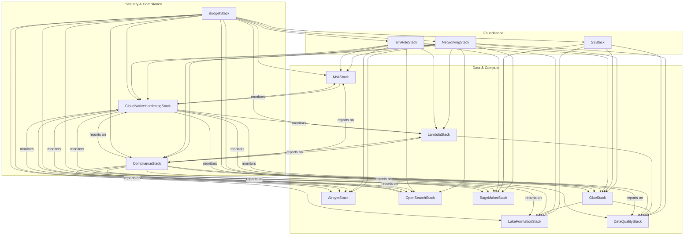

⬅️ Back to Project Overview
⬅️ Back to Checklist
🛡️ ShieldCraft AI: AWS Stack Architecture & Dependency Map
This document provides a comprehensive overview of all major infrastructure stacks in ShieldCraft AI, their responsibilities,
and how they interact to deliver a secure, modular, and production-grade MLOps platform.
All relationships
are defined in code for full reproducibility and auditability.

:::tip
Recent Architectural Improvements & Best Practices
Centralized Vault Integration:
All major stacks now accept a
secrets_manager_arn
parameter, importing the AWS Secrets Manager vault secret, exporting its ARN via
CfnOutput
, and exposing it in
shared_resources
for secure, auditable cross-stack consumption. This supports centralized secrets management, auditability, and downstream wiring.
Config-Driven Permissions & Resource Validation:
All major stacks now use config-driven permissions and resource wiring. Validation methods ensure referenced resources (S3, Glue, OpenSearch, SageMaker, MSK, Networking) exist and are correctly configured before stack creation. Fail-fast validation supports both happy and unhappy paths.
Constructor Refactoring:
Stack constructors only pass valid AWS CDK arguments (
env
,
tags
,
description
) to
super().__init__()
. Custom arguments (roles, resource ARNs, config dicts) are handled locally, supporting modularity and loose coupling.
Cross-Stack Resource Exporting:
All critical resources (e.g., alarm ARNs, config rule ARNs, bucket names, role ARNs) are exported via
CfnOutput
for auditability and downstream consumption. Downstream stacks use
Fn.import_value
to consume these outputs, ensuring explicit, testable relationships.
Parallelization & Modularity:
Resource creation logic is modular and can be parallelized in CI/CD for large environments. Stacks are designed for minimal blast radius and maximum composability.
Security & Compliance:
Permissions boundaries and session policies are enforced via config and centralized IAM role management. AWS Config rules and CloudWatch alarms are parameterized and validated, supporting compliance and monitoring.
CI/CD & Test Hardening:
Pipeline stack enforces required parameters (e.g., non-empty GitHub connection ARN). Integration tests validate both happy and unhappy paths, including cross-stack outputs and resource wiring.
Documentation & Auditability:
Architectural insights, dependency matrix, and stack roles are documented for maintainers. All relationships and outputs are defined in code for reproducibility and auditability.
Learnings & Best Practices
Explicit Validation:
Always validate cross-stack references and config inputs before resource creation.
Loose Coupling:
Export all shared resources; never hardcode dependencies.
Centralized IAM:
Manage all roles in a dedicated stack, passing ARNs via config.
Parallelism:
Design stacks for parallel deployment where possible.
Auditability:
Use
CfnOutput
for all critical resources; document outputs and imports.
Extensibility:
Parameterize compliance and monitoring rules for easy future updates.
Testing:
Cover both happy and unhappy paths, especially for resource validation and cross-stack outputs.
:::

Stack Roles & Responsibilities
Stack
Role
Key Resources
networking
Foundational network isolation and security
VPC, subnets, security groups,
vault secret (imported)
s3
Centralized object storage for all data and artifacts
S3 buckets,
vault secret (imported)
lakeformation
Data governance and fine-grained access control
Lake Formation resources, permissions,
vault secret (imported)
glue
ETL, data cataloging, and analytics
Glue jobs, crawlers, catalog,
vault secret (imported)
lambda
Event-driven compute and orchestration
Lambda functions, triggers,
vault secret (imported)
dataquality
Automated data quality checks and validation
Quality rules, validation jobs,
vault secret (imported)
airbyte
Connector-based data ingestion and movement
ECS services, connectors,
vault secret (imported)
opensearch
Search and analytics for logs and data
OpenSearch domains,
vault secret (imported)
cloud_native_hardening
Cross-cutting security, monitoring, compliance
CloudWatch alarms, Config rules, IAM boundaries,
vault secret (imported)
attack_simulation
Automated attack simulation and security validation
Lambda functions, CloudWatch alarms, imported secret ARN,
vault secret (imported)
secrets_manager
Centralized secrets management for all environments
AWS Secrets Manager secrets, resource policies, cross-stack exports
msk
Managed streaming for Kafka workloads
MSK clusters,
vault secret (imported)
sagemaker
Model training, deployment, and monitoring
SageMaker endpoints, models, monitoring,
vault secret (imported)
budget
Cost guardrails, budget alerts, and multi-channel notifications
AWS Budgets, SNS topics, email alerts,
vault secret (imported)

Expanded Dependency Matrix (Outputs & Inputs)
Stack
Exports (CfnOutput)
Consumed By (Fn.import_value)
Notes on Parallelism
IamRoleStack
All required IAM role ARNs
All stacks needing roles
Deploy first or in parallel, outputs must exist before import
NetworkingStack
VPC ID, SG IDs, Flow Logs ARN, vault secret ARN
All compute/data stacks
Same as above
S3Stack
data_bucket name/ARN, vault secret ARN
GlueStack, LakeFormationStack, etc.
S3Stack must finish before dependent stacks
GlueStack
Glue DB/catalog name, vault secret ARN
LakeFormationStack, DataQualityStack
GlueStack must finish before dependents
LakeFormationStack
Admin role, permissions, vault secret ARN
(If needed by other stacks)
MskStack
Broker info, client/producer/consumer roles, vault secret ARN
LambdaStack, AirbyteStack, etc.
LambdaStack
Lambda ARNs, vault secret ARN
DataQualityStack, ComplianceStack, AttackSimulationStack
AttackSimulationStack
Lambda ARN, alarm ARN, imported secret ARN
Security, audit, downstream consumers
Can run in parallel with other compute stacks
SecretsManagerStack
Secret ARNs, resource policies
All stacks needing secrets
Deploy first for secret availability
AirbyteStack
Endpoints, role ARN, vault secret ARN
(If needed by other stacks)
OpenSearchStack
Endpoint, role ARN, vault secret ARN
Analytics, LambdaStack
DataQualityStack
Metrics, alerts, vault secret ARN
(If needed by other stacks)
SageMakerStack
Endpoint, role ARN, vault secret ARN
ML pipeline, LambdaStack
CloudNativeHardeningStack
Security findings, config rules, vault secret ARN
(If needed by other stacks)
ComplianceStack
Compliance reports, Lambda ARNs, vault secret ARN
(If needed by other stacks)
BudgetStack
Budget ARNs, SNS topic ARN, vault secret ARN
All teams, FinOps, notifications
Deployed last, depends on all infra

How the Stacks Interact
networking
is foundational: all compute, data, and orchestration stacks (lambda, msk, airbyte, opensearch, glue, sagemaker) inject VPC, subnets, and security groups for secure, isolated deployments.
s3
provides buckets for all data, model artifacts, and logs. These are referenced by lakeformation, glue, dataquality, sagemaker, and lambda for storage, cataloging, and compliance.
lakeformation
registers S3 buckets for fine-grained data lake permissions, enabling secure, auditable access for glue, athena, and other consumers.
glue
and
dataquality
use S3 and VPC resources for ETL, data quality, and cataloging, sharing IAM roles and security groups as needed.
airbyte
deploys in ECS, using VPC, security groups, and secrets from other stacks for secure data movement.
sagemaker
provisions models, endpoints, and monitoring, using VPC, subnets, security groups, and S3 buckets from networking and storage stacks. Outputs (endpoints, alarms, ARNs) are available for downstream consumers.
opensearch
and
msk
provision search and streaming infrastructure, using VPC and security groups, and are monitored by
cloud_native_hardening
.
lambda
functions use VPC, security groups, and S3 buckets, and are monitored by
cloud_native_hardening
.
cloud_native_hardening
provides cross-cutting monitoring, compliance, and alerting for all critical resources, exporting alarm ARNs and key resources for use in other stacks.
attack_simulation
automates security validation by simulating attacks using Lambda functions and CloudWatch alarms, consuming secrets via imported ARNs and exporting results for audit and downstream use.
secrets_manager
centralizes all environment secrets, exports ARNs for cross-stack consumption, and enforces resource policies for least privilege.
Each stack exports key resources (e.g., ARNs, endpoints, VPC IDs) for use by others, supporting dependency injection and loose coupling.

Textual Overview
networking_stack
  ├─▶ msk_stack
  ├─▶ lambda_stack
  ├─▶ airbyte_stack
  ├─▶ opensearch_stack
  ├─▶ glue_stack
  ├─▶ sagemaker_stack
  ├─▶ dataquality_stack
  ├─▶ cloud_native_hardening_stack
  └─▶ compliance_stack

s3_stack
  ├─▶ lakeformation_stack
  ├─▶ glue_stack
  ├─▶ dataquality_stack
  └─▶ sagemaker_stack

iam_role_stack
  ├─▶ lambda_stack
  ├─▶ glue_stack
  ├─▶ msk_stack
  ├─▶ airbyte_stack
  ├─▶ opensearch_stack
  ├─▶ lakeformation_stack
  ├─▶ sagemaker_stack
  ├─▶ cloud_native_hardening_stack
  └─▶ compliance_stack

glue_stack
  ├─▶ dataquality_stack
  └─▶ lakeformation_stack

lambda_stack
  ├─▶ dataquality_stack
  └─▶ compliance_stack

msk_stack
  ├─▶ cloud_native_hardening_stack

opensearch_stack
  ├─▶ cloud_native_hardening_stack

cloud_native_hardening_stack
  └─▶ (monitors all critical stacks)

compliance_stack
  └─▶ (reports on all critical stacks)

sagemaker_stack
  (consumes VPC, S3, IAM)

budget_stack
  (depends on all other stacks; provides cost guardrails and notifications)

:::info
Architectural Insights
Centralized secrets management is enforced via AWS Secrets Manager vault integration. All stacks import the vault secret, export its ARN, and expose it in
shared_resources
for secure, auditable downstream consumption.
AttackSimulationStack
and other security stacks consume secret ARNs for runtime access, supporting automated security validation and audit.
Stacks are modular, composable, and parameterized for maximum flexibility and reuse.
Security, compliance, and monitoring are embedded via cross-stack resource sharing and the hardening stack.
All relationships are explicit and testable, supporting both happy and unhappy paths.
Outputs and shared resources are robustly validated in tests, ensuring reliability for downstream consumers.
Design supports cloud-native, MLOps, and enterprise best practices for production workloads.
:::

:::tip
Legend & Guidance
Arrows
(
▶
) indicate dependency or resource consumption.
Stacks at the top (networking, S3) are foundational; others build on them.
“Cross-cutting” stacks (like
cloud_native_hardening
) add security/monitoring to all.
All relationships are defined in code for full reproducibility and auditability.
For a graphical version, consider using Mermaid or PlantUML with this structure as a base.
:::

IAM Role Management & Config-Driven Permissions
All IAM roles are created centrally in
IamRoleStack
and passed to consuming stacks via cross-stack references, ensuring least-privilege, auditable, and environment-specific permissions.
AttackSimulationStack
and
SecretsManagerStack
also consume roles for secure Lambda execution and secret management.
Stacks no longer create their own roles; instead, they accept role ARNs as constructor arguments, supporting modularity and security best practices.
Permissions and resource wiring are fully config-driven, enabling rapid environment changes and consistent policy enforcement across dev, staging, and prod.
Tests validate that all stacks receive the correct role ARNs and that no stack creates ad hoc roles, supporting compliance and traceability.

Compliance Stack Extensibility
The
compliance
stack is designed for extensibility: it accepts a config dict and a Lambda role ARN, enabling both managed and Lambda-backed AWS Config rules.
AttackSimulationStack
is similarly extensible, accepting simulation configs and secret ARNs for dynamic security validation.
Required tag rules and other compliance controls are parameterized via config, supporting organization-wide policy enforcement.
Future compliance rules can be added by updating the config and wiring in new Lambda-backed rules using the provided role, without changing stack wiring or permissions.

## Graphical Stack Dependency Diagram (Mermaid)

