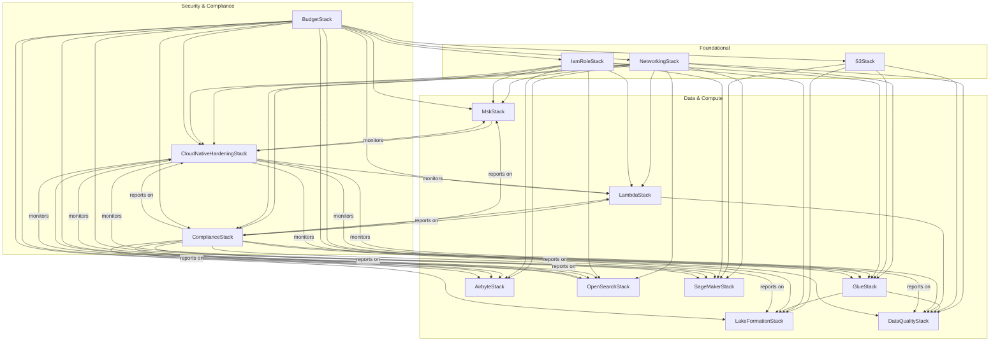

<section style="border:1px solid #a5b4fc; border-radius:10px; margin:1.5em 0; box-shadow:0 2px 8px #222; padding:1.5em; background:#111; color:#fff;">

  <a href="../../README.md" style="color:#a5b4fc; font-weight:bold; text-decoration:none; font-size:1.1em;">⬅️ Back to Project Overview</a>

  <a href="./checklist.md" style="color:#a5b4fc; font-weight:bold; text-decoration:none; font-size:1.1em;">⬅️ Back to Checklist</a>

<h1 align="center" style="margin-top:0; font-size:2em; color:#a5b4fc;">🛡️ ShieldCraft AI: AWS Stack Architecture & Dependency Map</h1>

  This document provides a comprehensive overview of all major infrastructure stacks in ShieldCraft AI, their responsibilities,  and how they interact to deliver a secure, modular, and production-grade MLOps platform.
  All relationships  are defined in code for full reproducibility and auditability.

</section>

<section style="border:1px solid #a5b4fc; border-radius:10px; margin:1.5em 0; box-shadow:0 2px 8px #222; padding:1.5em; background:#181818; color:#fff;">
<h2 style="color:#a5b4fc; margin-top:0;">Recent Architectural Improvements & Best Practices</h2>
<ul style="color:#b3b3b3;">
  <li><b>Centralized Vault Integration:</b> All major stacks now accept a <code>secrets_manager_arn</code> parameter, importing the AWS Secrets Manager vault secret, exporting its ARN via <code>CfnOutput</code>, and exposing it in <code>shared_resources</code> for secure, auditable cross-stack consumption. This supports centralized secrets management, auditability, and downstream wiring.</li>
  <li><b>Config-Driven Permissions & Resource Validation:</b> All major stacks now use config-driven permissions and resource wiring. Validation methods ensure referenced resources (S3, Glue, OpenSearch, SageMaker, MSK, Networking) exist and are correctly configured before stack creation. Fail-fast validation supports both happy and unhappy paths.</li>
  <li><b>Constructor Refactoring:</b> Stack constructors only pass valid AWS CDK arguments (<code>env</code>, <code>tags</code>, <code>description</code>) to <code>super().__init__()</code>. Custom arguments (roles, resource ARNs, config dicts) are handled locally, supporting modularity and loose coupling.</li>
  <li><b>Cross-Stack Resource Exporting:</b> All critical resources (e.g., alarm ARNs, config rule ARNs, bucket names, role ARNs) are exported via <code>CfnOutput</code> for auditability and downstream consumption. Downstream stacks use <code>Fn.import_value</code> to consume these outputs, ensuring explicit, testable relationships.</li>
  <li><b>Parallelization & Modularity:</b> Resource creation logic is modular and can be parallelized in CI/CD for large environments. Stacks are designed for minimal blast radius and maximum composability.</li>
  <li><b>Security & Compliance:</b> Permissions boundaries and session policies are enforced via config and centralized IAM role management. AWS Config rules and CloudWatch alarms are parameterized and validated, supporting compliance and monitoring.</li>
  <li><b>CI/CD & Test Hardening:</b> Pipeline stack enforces required parameters (e.g., non-empty GitHub connection ARN). Integration tests validate both happy and unhappy paths, including cross-stack outputs and resource wiring.</li>
  <li><b>Documentation & Auditability:</b> Architectural insights, dependency matrix, and stack roles are documented for maintainers. All relationships and outputs are defined in code for reproducibility and auditability.</li>
</ul>
<h3 style="color:#a5b4fc; margin-top:1.5em;">Learnings & Best Practices</h3>
<ul style="color:#b3b3b3;">
  <li><b>Explicit Validation:</b> Always validate cross-stack references and config inputs before resource creation.</li>
  <li><b>Loose Coupling:</b> Export all shared resources; never hardcode dependencies.</li>
  <li><b>Centralized IAM:</b> Manage all roles in a dedicated stack, passing ARNs via config.</li>
  <li><b>Parallelism:</b> Design stacks for parallel deployment where possible.</li>
  <li><b>Auditability:</b> Use <code>CfnOutput</code> for all critical resources; document outputs and imports.</li>
  <li><b>Extensibility:</b> Parameterize compliance and monitoring rules for easy future updates.</li>
  <li><b>Testing:</b> Cover both happy and unhappy paths, especially for resource validation and cross-stack outputs.</li>
</ul>
</section>

<section style="border:1px solid #a5b4fc; border-radius:10px; margin:1.5em 0; box-shadow:0 2px 8px #222; padding:1.5em; background:#111; color:#fff;">
<h2 style="color:#a5b4fc; margin-top:0;">Stack Roles & Responsibilities</h2>
<table style="width:100%; background:#181818; color:#fff; border-radius:8px; border-collapse:collapse;">
  <thead style="background:#232323; color:#a5b4fc;">
    <tr>
      <th style="text-align:left; padding:0.5em 1em;">Stack</th>
      <th style="text-align:left; padding:0.5em 1em;">Role</th>
      <th style="text-align:left; padding:0.5em 1em;">Key Resources</th>
    </tr>
  </thead>
  <tbody>
    <tr><td><b>networking</b></td><td>Foundational network isolation and security</td><td>VPC, subnets, security groups, vault secret (imported)</td></tr>
    <tr><td><b>s3</b></td><td>Centralized object storage for all data and artifacts</td><td>S3 buckets, vault secret (imported)</td></tr>
    <tr><td><b>lakeformation</b></td><td>Data governance and fine-grained access control</td><td>Lake Formation resources, permissions, vault secret (imported)</td></tr>
    <tr><td><b>glue</b></td><td>ETL, data cataloging, and analytics</td><td>Glue jobs, crawlers, catalog, vault secret (imported)</td></tr>
    <tr><td><b>lambda</b></td><td>Event-driven compute and orchestration</td><td>Lambda functions, triggers, vault secret (imported)</td></tr>
    <tr><td><b>dataquality</b></td><td>Automated data quality checks and validation</td><td>Quality rules, validation jobs, vault secret (imported)</td></tr>
    <tr><td><b>airbyte</b></td><td>Connector-based data ingestion and movement</td><td>ECS services, connectors, vault secret (imported)</td></tr>
    <tr><td><b>opensearch</b></td><td>Search and analytics for logs and data</td><td>OpenSearch domains, vault secret (imported)</td></tr>
    <tr><td><b>cloud_native_hardening</b></td><td>Cross-cutting security, monitoring, compliance</td><td>CloudWatch alarms, Config rules, IAM boundaries, vault secret (imported)</td></tr>
    <tr><td><b>attack_simulation</b></td><td>Automated attack simulation and security validation</td><td>Lambda functions, CloudWatch alarms, imported secret ARN, vault secret (imported)</td></tr>
    <tr><td><b>secrets_manager</b></td><td>Centralized secrets management for all environments</td><td>AWS Secrets Manager secrets, resource policies, cross-stack exports</td></tr>
    <tr><td><b>msk</b></td><td>Managed streaming for Kafka workloads</td><td>MSK clusters, vault secret (imported)</td></tr>
    <tr><td><b>sagemaker</b></td><td>Model training, deployment, and monitoring</td><td>SageMaker endpoints, models, monitoring, vault secret (imported)</td></tr>
    <tr><td><b>budget</b></td><td>Cost guardrails, budget alerts, and multi-channel notifications</td><td>AWS Budgets, SNS topics, email alerts, vault secret (imported)</td></tr>
  </tbody>
</table>
</section>

</section>

<section style="border:1px solid #a5b4fc; border-radius:10px; margin:1.5em 0; box-shadow:0 2px 8px #222; padding:1.5em; background:#111; color:#fff;">
<h2 style="color:#a5b4fc; margin-top:0;">Expanded Dependency Matrix (Outputs & Inputs)</h2>

<table style="width:100%; background:#181818; color:#fff; border-radius:8px; border-collapse:collapse;">
  <thead style="background:#232323; color:#a5b4fc;">
    <tr>
      <th style="text-align:left; padding:0.5em 1em;">Stack</th>
      <th style="text-align:left; padding:0.5em 1em;">Exports (CfnOutput)</th>
      <th style="text-align:left; padding:0.5em 1em;">Consumed By (Fn.import_value)</th>
      <th style="text-align:left; padding:0.5em 1em;">Notes on Parallelism</th>
    </tr>
  </thead>
  <tbody>
    <tr><td><b>IamRoleStack</b></td><td>All required IAM role ARNs</td><td>All stacks needing roles</td><td>Deploy first or in parallel, outputs must exist before import</td></tr>
    <tr><td><b>NetworkingStack</b></td><td>VPC ID, SG IDs, Flow Logs ARN, vault secret ARN</td><td>All compute/data stacks</td><td>Same as above</td></tr>
    <tr><td><b>S3Stack</b></td><td>data_bucket name/ARN, vault secret ARN</td><td>GlueStack, LakeFormationStack, etc.</td><td>S3Stack must finish before dependent stacks</td></tr>
    <tr><td><b>GlueStack</b></td><td>Glue DB/catalog name, vault secret ARN</td><td>LakeFormationStack, DataQualityStack</td><td>GlueStack must finish before dependents</td></tr>
    <tr><td><b>LakeFormationStack</b></td><td>Admin role, permissions, vault secret ARN</td><td>(If needed by other stacks)</td><td></td></tr>
    <tr><td><b>MskStack</b></td><td>Broker info, client/producer/consumer roles, vault secret ARN</td><td>LambdaStack, AirbyteStack, etc.</td><td></td></tr>
    <tr><td><b>LambdaStack</b></td><td>Lambda ARNs, vault secret ARN</td><td>DataQualityStack, ComplianceStack, AttackSimulationStack</td><td></td></tr>
    <tr><td><b>AttackSimulationStack</b></td><td>Lambda ARN, alarm ARN, imported secret ARN</td><td>Security, audit, downstream consumers</td><td>Can run in parallel with other compute stacks</td></tr>
    <tr><td><b>SecretsManagerStack</b></td><td>Secret ARNs, resource policies</td><td>All stacks needing secrets</td><td>Deploy first for secret availability</td></tr>
    <tr><td><b>AirbyteStack</b></td><td>Endpoints, role ARN, vault secret ARN</td><td>(If needed by other stacks)</td><td></td></tr>
    <tr><td><b>OpenSearchStack</b></td><td>Endpoint, role ARN, vault secret ARN</td><td>Analytics, LambdaStack</td><td></td></tr>
    <tr><td><b>DataQualityStack</b></td><td>Metrics, alerts, vault secret ARN</td><td>(If needed by other stacks)</td><td></td></tr>
    <tr><td><b>SageMakerStack</b></td><td>Endpoint, role ARN, vault secret ARN</td><td>ML pipeline, LambdaStack</td><td></td></tr>
    <tr><td><b>CloudNativeHardeningStack</b></td><td>Security findings, config rules, vault secret ARN</td><td>(If needed by other stacks)</td><td></td></tr>
    <tr><td><b>ComplianceStack</b></td><td>Compliance reports, Lambda ARNs, vault secret ARN</td><td>(If needed by other stacks)</td><td></td></tr>
    <tr><td><b>BudgetStack</b></td><td>Budget ARNs, SNS topic ARN, vault secret ARN</td><td>All teams, FinOps, notifications</td><td>Deployed last, depends on all infra</td></tr>
  </tbody>
</table>

</section>
</section>

<section style="border:1px solid #a5b4fc; border-radius:10px; margin:1.5em 0; box-shadow:0 2px 8px #222; padding:1.5em; background:#111; color:#fff;">
<h2 style="color:#a5b4fc; margin-top:0;">How the Stacks Interact</h2>
<ul style="color:#b3b3b3;">
  <li><b>networking</b> is foundational: all compute, data, and orchestration stacks (lambda, msk, airbyte, opensearch, glue, sagemaker) inject VPC, subnets, and security groups for secure, isolated deployments.</li>
  <li><b>s3</b> provides buckets for all data, model artifacts, and logs. These are referenced by lakeformation, glue, dataquality, sagemaker, and lambda for storage, cataloging, and compliance.</li>
  <li><b>lakeformation</b> registers S3 buckets for fine-grained data lake permissions, enabling secure, auditable access for glue, athena, and other consumers.</li>
  <li><b>glue</b> and <b>dataquality</b> use S3 and VPC resources for ETL, data quality, and cataloging, sharing IAM roles and security groups as needed.</li>
  <li><b>airbyte</b> deploys in ECS, using VPC, security groups, and secrets from other stacks for secure data movement.</li>
  <li><b>sagemaker</b> provisions models, endpoints, and monitoring, using VPC, subnets, security groups, and S3 buckets from networking and storage stacks. Outputs (endpoints, alarms, ARNs) are available for downstream consumers.</li>
  <li><b>opensearch</b> and <b>msk</b> provision search and streaming infrastructure, using VPC and security groups, and are monitored by <b>cloud_native_hardening</b>.</li>
  <li><b>lambda</b> functions use VPC, security groups, and S3 buckets, and are monitored by <b>cloud_native_hardening</b>.</li>
  <li><b>cloud_native_hardening</b> provides cross-cutting monitoring, compliance, and alerting for all critical resources, exporting alarm ARNs and key resources for use in other stacks.</li>
  <li><b>attack_simulation</b> automates security validation by simulating attacks using Lambda functions and CloudWatch alarms, consuming secrets via imported ARNs and exporting results for audit and downstream use.</li>
  <li><b>secrets_manager</b> centralizes all environment secrets, exports ARNs for cross-stack consumption, and enforces resource policies for least privilege.</li>
  <li>Each stack exports key resources (e.g., ARNs, endpoints, VPC IDs) for use by others, supporting dependency injection and loose coupling.</li>
</ul>
</section>

<section style="border:1px solid #a5b4fc; border-radius:10px; margin:1.5em 0; box-shadow:0 2px 8px #222; padding:1.5em; background:#111; color:#fff;">
<h2 style="color:#a5b4fc; margin-top:0;">Textual Overview</h2>
<pre style="background:#181818; color:#fff; padding:1em; border-radius:8px; font-size:1em;">
networking_stack
  ├─▶ msk_stack
  ├─▶ lambda_stack
  ├─▶ airbyte_stack
  ├─▶ opensearch_stack
  ├─▶ glue_stack
  ├─▶ sagemaker_stack
  ├─▶ dataquality_stack
  ├─▶ cloud_native_hardening_stack
  └─▶ compliance_stack

s3_stack
  ├─▶ lakeformation_stack
  ├─▶ glue_stack
  ├─▶ dataquality_stack
  └─▶ sagemaker_stack

iam_role_stack
  ├─▶ lambda_stack
  ├─▶ glue_stack
  ├─▶ msk_stack
  ├─▶ airbyte_stack
  ├─▶ opensearch_stack
  ├─▶ lakeformation_stack
  ├─▶ sagemaker_stack
  ├─▶ cloud_native_hardening_stack
  └─▶ compliance_stack

glue_stack
  ├─▶ dataquality_stack
  └─▶ lakeformation_stack

lambda_stack
  ├─▶ dataquality_stack
  └─▶ compliance_stack

msk_stack
  ├─▶ cloud_native_hardening_stack

opensearch_stack
  ├─▶ cloud_native_hardening_stack

cloud_native_hardening_stack
  └─▶ (monitors all critical stacks)

compliance_stack
  └─▶ (reports on all critical stacks)

sagemaker_stack
  (consumes VPC, S3, IAM)

budget_stack
  (depends on all other stacks; provides cost guardrails and notifications)

</pre>
</section>

<section style="border:1px solid #a5b4fc; border-radius:10px; margin:1.5em 0; box-shadow:0 2px 8px #222; padding:1.5em; background:#111; color:#fff;">
<h2 style="color:#a5b4fc; margin-top:0;">Architectural Insights</h2>
<ul style="color:#b3b3b3;">
  <li>Centralized secrets management is enforced via AWS Secrets Manager vault integration. All stacks import the vault secret, export its ARN, and expose it in <code>shared_resources</code> for secure, auditable downstream consumption. <b>AttackSimulationStack</b> and other security stacks consume secret ARNs for runtime access, supporting automated security validation and audit.</li>
  <li>Stacks are modular, composable, and parameterized for maximum flexibility and reuse.</li>
  <li>Security, compliance, and monitoring are embedded via cross-stack resource sharing and the hardening stack.</li>
  <li>All relationships are explicit and testable, supporting both happy and unhappy paths.</li>
  <li>Outputs and shared resources are robustly validated in tests, ensuring reliability for downstream consumers.</li>
  <li>Design supports cloud-native, MLOps, and enterprise best practices for production workloads.</li>
</ul>
</section>

<section style="border:1px solid #a5b4fc; border-radius:10px; margin:1.5em 0; box-shadow:0 2px 8px #222; padding:1.5em; background:#111; color:#fff;">
<h2 style="color:#a5b4fc; margin-top:0;">Legend & Guidance</h2>
<ul style="color:#b3b3b3;">
  <li><b>Arrows</b> (<code>▶</code>) indicate dependency or resource consumption.</li>
  <li>Stacks at the top (networking, S3) are foundational; others build on them.</li>
  <li>“Cross-cutting” stacks (like <code>cloud_native_hardening</code>) add security/monitoring to all.</li>
  <li>All relationships are defined in code for full reproducibility and auditability.</li>
</ul>

For a graphical version, consider using Mermaid or PlantUML with this structure as a base.

</section>

<section style="border:1px solid #a5b4fc; border-radius:10px; margin:1.5em 0; box-shadow:0 2px 8px #222; padding:1.5em; background:#111; color:#fff;">
<h2 style="color:#a5b4fc; margin-top:0;">IAM Role Management & Config-Driven Permissions</h2>
<ul style="color:#b3b3b3;">
  <li>All IAM roles are created centrally in <b>IamRoleStack</b> and passed to consuming stacks via cross-stack references, ensuring least-privilege, auditable, and environment-specific permissions. <b>AttackSimulationStack</b> and <b>SecretsManagerStack</b> also consume roles for secure Lambda execution and secret management.</li>
  <li>Stacks no longer create their own roles; instead, they accept role ARNs as constructor arguments, supporting modularity and security best practices.</li>
  <li>Permissions and resource wiring are fully config-driven, enabling rapid environment changes and consistent policy enforcement across dev, staging, and prod.</li>
  <li>Tests validate that all stacks receive the correct role ARNs and that no stack creates ad hoc roles, supporting compliance and traceability.</li>
</ul>
</section>

<section style="border:1px solid #a5b4fc; border-radius:10px; margin:1.5em 0; box-shadow:0 2px 8px #222; padding:1.5em; background:#111; color:#fff;">
<h2 style="color:#a5b4fc; margin-top:0;">Compliance Stack Extensibility</h2>
<ul style="color:#b3b3b3;">
  <li>The <b>compliance</b> stack is designed for extensibility: it accepts a config dict and a Lambda role ARN, enabling both managed and Lambda-backed AWS Config rules. <b>AttackSimulationStack</b> is similarly extensible, accepting simulation configs and secret ARNs for dynamic security validation.</li>
  <li>Required tag rules and other compliance controls are parameterized via config, supporting organization-wide policy enforcement.</li>
  <li>Future compliance rules can be added by updating the config and wiring in new Lambda-backed rules using the provided role, without changing stack wiring or permissions.</li>
</ul>
</section>

## Graphical Stack Dependency Diagram (Mermaid)

> **How to use:** Copy the above Mermaid diagram into your markdown viewer or documentation tool (e.g., GitHub, VS Code, Mermaid Live Editor) to visualize stack dependencies and relationships.

---
