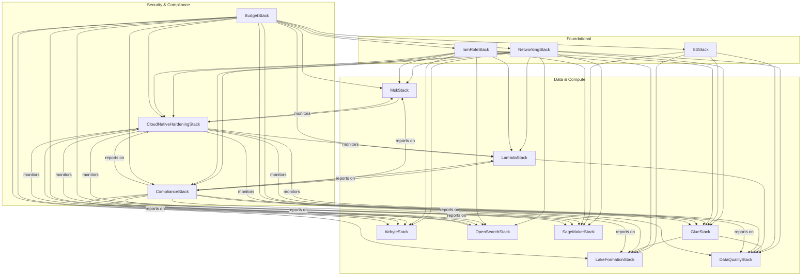

<section>

  <a href="../../../README.md">⬅️ Back to Project Overview</a>

  <a href="./checklist.md">⬅️ Back to Checklist</a>

<h1 align="center">🛡️ ShieldCraft AI: AWS Stack Architecture & Dependency Map</h1>

</section>

<section>
<h2>Recent Architectural Improvements & Best Practices</h2>
<ul>
</ul>
<h3>Learnings & Best Practices</h3>
<ul>
</ul></section>

<section>
<h2>Stack Roles & Responsibilities</h2>
<table>
  <thead>
    <tr>
      <th>Stack</th>
      <th>Role</th>
      <th>Key Resources</th>
    </tr>
  </thead>
  <tbody>
    <tr><td><b>networking</b></td><td>Foundational network isolation and security</td><td>VPC, subnets, security groups, vault secret (imported)</td></tr>
    <tr><td><b>s3</b></td><td>Centralized object storage for all data and artifacts</td><td>S3 buckets, vault secret (imported)</td></tr>
    <tr><td><b>lakeformation</b></td><td>Data governance and fine-grained access control</td><td>Lake Formation resources, permissions, vault secret (imported)</td></tr>
    <tr><td><b>glue</b></td><td>ETL, data cataloging, and analytics</td><td>Glue jobs, crawlers, catalog, vault secret (imported)</td></tr>
    <tr><td><b>lambda</b></td><td>Event-driven compute and orchestration</td><td>Lambda functions, triggers, vault secret (imported)</td></tr>
    <tr><td><b>dataquality</b></td><td>Automated data quality checks and validation</td><td>Quality rules, validation jobs, vault secret (imported)</td></tr>
    <tr><td><b>airbyte</b></td><td>Connector-based data ingestion and movement</td><td>ECS services, connectors, vault secret (imported)</td></tr>
    <tr><td><b>opensearch</b></td><td>Search and analytics for logs and data</td><td>OpenSearch domains, vault secret (imported)</td></tr>
    <tr><td><b>cloud_native_hardening</b></td><td>Cross-cutting security, monitoring, compliance</td><td>CloudWatch alarms, Config rules, IAM boundaries, vault secret (imported)</td></tr>
    <tr><td><b>attack_simulation</b></td><td>Automated attack simulation and security validation</td><td>Lambda functions, CloudWatch alarms, imported secret ARN, vault secret (imported)</td></tr>
    <tr><td><b>secrets_manager</b></td><td>Centralized secrets management for all environments</td><td>AWS Secrets Manager secrets, resource policies, cross-stack exports</td></tr>
    <tr><td><b>msk</b></td><td>Managed streaming for Kafka workloads</td><td>MSK clusters, vault secret (imported)</td></tr>
    <tr><td><b>sagemaker</b></td><td>Model training, deployment, and monitoring</td><td>SageMaker endpoints, models, monitoring, vault secret (imported)</td></tr>
    <tr><td><b>budget</b></td><td>Cost guardrails, budget alerts, and multi-channel notifications</td><td>AWS Budgets, SNS topics, email alerts, vault secret (imported)</td></tr>
  </tbody>
</table>
</section>

<section>
<h2>Expanded Dependency Matrix (Outputs & Inputs)</h2>

<table>
  <thead>
    <tr>
      <th>Stack</th>
      <th>Exports (CfnOutput)</th>
      <th>Consumed By (Fn.import_value)</th>
      <th>Notes on Parallelism</th>
    </tr>
  </thead>
  <tbody>
    <tr><td><b>IamRoleStack</b></td><td>All required IAM role ARNs</td><td>All stacks needing roles</td><td>Deploy first or in parallel, outputs must exist before import</td></tr>
    <tr><td><b>NetworkingStack</b></td><td>VPC ID, SG IDs, Flow Logs ARN, vault secret ARN</td><td>All compute/data stacks</td><td>Same as above</td></tr>
    <tr><td><b>S3Stack</b></td><td>data_bucket name/ARN, vault secret ARN</td><td>GlueStack, LakeFormationStack, etc.</td><td>S3Stack must finish before dependent stacks</td></tr>
    <tr><td><b>GlueStack</b></td><td>Glue DB/catalog name, vault secret ARN</td><td>LakeFormationStack, DataQualityStack</td><td>GlueStack must finish before dependents</td></tr>
    <tr><td><b>LakeFormationStack</b></td><td>Admin role, permissions, vault secret ARN</td><td>(If needed by other stacks)</td><td></td></tr>
    <tr><td><b>MskStack</b></td><td>Broker info, client/producer/consumer roles, vault secret ARN</td><td>LambdaStack, AirbyteStack, etc.</td><td></td></tr>
    <tr><td><b>LambdaStack</b></td><td>Lambda ARNs, vault secret ARN</td><td>DataQualityStack, ComplianceStack, AttackSimulationStack</td><td></td></tr>
    <tr><td><b>AttackSimulationStack</b></td><td>Lambda ARN, alarm ARN, imported secret ARN</td><td>Security, audit, downstream consumers</td><td>Can run in parallel with other compute stacks</td></tr>
    <tr><td><b>SecretsManagerStack</b></td><td>Secret ARNs, resource policies</td><td>All stacks needing secrets</td><td>Deploy first for secret availability</td></tr>
    <tr><td><b>AirbyteStack</b></td><td>Endpoints, role ARN, vault secret ARN</td><td>(If needed by other stacks)</td><td></td></tr>
    <tr><td><b>OpenSearchStack</b></td><td>Endpoint, role ARN, vault secret ARN</td><td>Analytics, LambdaStack</td><td></td></tr>
    <tr><td><b>DataQualityStack</b></td><td>Metrics, alerts, vault secret ARN</td><td>(If needed by other stacks)</td><td></td></tr>
    <tr><td><b>SageMakerStack</b></td><td>Endpoint, role ARN, vault secret ARN</td><td>ML pipeline, LambdaStack</td><td></td></tr>
    <tr><td><b>CloudNativeHardeningStack</b></td><td>Security findings, config rules, vault secret ARN</td><td>(If needed by other stacks)</td><td></td></tr>
    <tr><td><b>ComplianceStack</b></td><td>Compliance reports, Lambda ARNs, vault secret ARN</td><td>(If needed by other stacks)</td><td></td></tr>
    <tr><td><b>BudgetStack</b></td><td>Budget ARNs, SNS topic ARN, vault secret ARN</td><td>All teams, FinOps, notifications</td><td>Deployed last, depends on all infra</td></tr>
  </tbody>
</table>

</section>

<section>
<h2>How the Stacks Interact</h2>
<ul>
</ul></section>

<section>
<h2>Textual Overview</h2>
<pre>
networking_stack
  ├─▶ msk_stack
  ├─▶ lambda_stack
  ├─▶ airbyte_stack
  ├─▶ opensearch_stack
  ├─▶ glue_stack
  ├─▶ sagemaker_stack
  ├─▶ dataquality_stack
  ├─▶ cloud_native_hardening_stack
  └─▶ compliance_stack

s3\_stack
├─▶ lakeformation_stack
├─▶ glue_stack
├─▶ dataquality_stack
└─▶ sagemaker_stack

iam_role_stack
├─▶ lambda_stack
├─▶ glue_stack
├─▶ msk_stack
├─▶ airbyte_stack
├─▶ opensearch_stack
├─▶ lakeformation_stack
├─▶ sagemaker_stack
├─▶ cloud_native_hardening_stack
└─▶ compliance_stack

glue_stack
├─▶ dataquality_stack
└─▶ lakeformation_stack

lambda_stack
├─▶ dataquality_stack
└─▶ compliance_stack

msk_stack
├─▶ cloud_native_hardening_stack

opensearch_stack
├─▶ cloud_native_hardening_stack

cloud_native_hardening_stack
└─▶ (monitors all critical stacks)

compliance_stack
└─▶ (reports on all critical stacks)

sagemaker_stack
(consumes VPC, S3, IAM)

budget_stack
(depends on all other stacks; provides cost guardrails and notifications)

</pre></section>

<section>
<h2>Architectural Insights</h2>
<ul>
</ul></section>

<section>
<h2>Legend & Guidance</h2>
<ul>
</ul></section>

<section>
<h2>IAM Role Management & Config-Driven Permissions</h2>
<ul>
</ul></section>

<section>
<h2>Compliance Stack Extensibility</h2>
<ul>
</ul></section>

## Graphical Stack Dependency Diagram (Mermaid)

